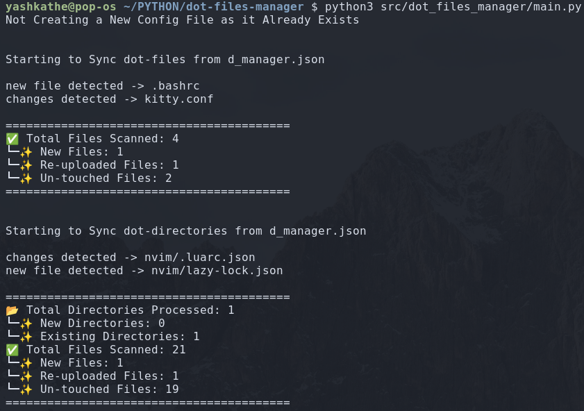

# Dotfiles Manager

A simple script to **sync dotfiles and directories** to a central *emit_folder* for backup or management.

## Usage

### 1. Installation

```bash
make install
```

### 2. Populate d_manager.json

```text
"dot_files": {
        "directories": [
            *path of directories to track*
        ],
        "files": [
            *path of files to track*
        ]
    },
    "emit_folder": *path of directory where all dot files & directories should be colleced*,
```

### 3. Execute

```bash
make run
```

## Output


